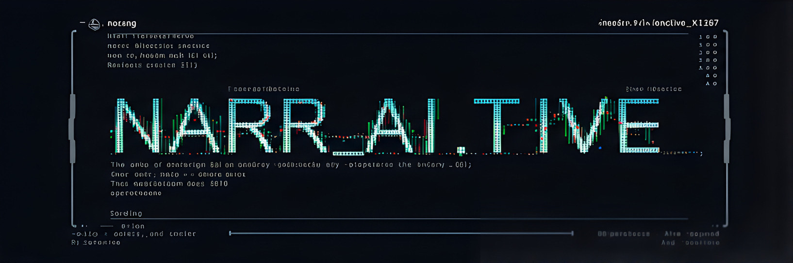

<div align="center">
  
</div>

# Narr.AI.tive 🤖📚

[](#)
[](#)
[](#)
[](#)
[](#)
[](https://github.com/pypa/hatch)
[](https://opensource.org/licenses/MIT)

> 🚀 A next-generation AI story generator powered by Google's Gemini model

## 📖 Overview

**Narr_ai_tive** is an advanced AI-powered story generator that leverages Google's Gemini model to create rich, engaging narratives. Here is a detailed overview of its features and functionalities:

## 📚 Table of Contents

- [Overview](#-overview)
- [Features](#-features)
  - [Advanced Story Generation](#-advanced-story-generation)
  - [Smart Content Management](#-smart-content-management)
  - [Quality Metrics](#-quality-metrics)
  - [Multiple Interfaces](#-multiple-interfaces)
- [Quick Start](#-quick-start)
  - [Prerequisites](#prerequisites)
  - [Installation](#installation)
- [Usage](#-usage)
  - [Interactive TUI](#interactive-tui)
  - [CLI Generation](#cli-generation)
  - [Python API](#python-api)
- [Project Structure](#-project-structure)
- [Configuration](#-configuration)
- [License](#-license)
- [Show Your Support](#-show-your-support)
- [Roadmap](#-roadmap)

## ✨ Features

### 🧠 Advanced Story Generation
- 🤖 **Gemini-Powered Generation** - Leverage Google's cutting-edge language model
- 🎭 **Multiple Story Styles** - From dark fantasy to sci-fi and beyond
- 👥 **Character Integration** - Deep character development and consistency
- 🌍 **World Building** - Rich world details and environment descriptions
- 📚 **Plot Management** - Smart context tracking and story progression

### 🔍 Smart Content Management
- 🧮 **Semantic Search** - Find relevant context using advanced embeddings
- 📝 **Auto-Chunking** - Intelligent content organization
- 💾 **Caching System** - Efficient generation with smart caching
- 🎭 **Character Profiles** - Detailed character management
- 🌟 **World Details** - Comprehensive world-building system

### 📊 Quality Metrics
- 📈 **Multi-Metric Evaluation** - ROUGE, BLEU, semantic similarity
- 📚 **Lexical Analysis** - Vocabulary richness and diversity checks
- 🔄 **Iterative Improvement** - Quality-based regeneration
- ⚖️ **Configurable Thresholds** - Customizable quality standards

### 🖥️ Multiple Interfaces
- 🎨 **Rich TUI** - Beautiful terminal interface with progress tracking
- ⌨️ **CLI Support** - Command-line automation capabilities
- 📱 **Interactive Mode** - Dynamic story development
- 📝 **Export Options** - Multiple output formats (TXT, MD, HTML)

## 🚀 Quick Start

### Prerequisites

Before installing Narr_ai_tive, ensure you have:

#### Required Software
- Python 3.8+
- [Hatchling](https://hatch.pypa.io/latest/)
- Google API key (Gemini access)

#### Required Data Setup
- Document embeddings in `data/embeddings.json`
  - See [Embeddings Setup Guide](docs/embeddings_setup.md)
  - Must be generated before running the application
  - Uses sentence-transformers format
  - Required for semantic search functionality

#### Required Files Structure
```
data/
├── embeddings.json     # Your document embeddings
├── character_profiles.json
└── world_details.json
```

#### API Keys
- Google Gemini API key
- Store in `secrets.yaml`
- Never commit this file to version control

### Installation

```bash
# Clone repository
git clone https://github.com/yourusername/Narr_ai_tive.git
cd Narr_ai_tive

# Create virtual environment
python -m venv venv
source venv/bin/activate  # Linux/Mac
# OR
venv\Scripts\activate     # Windows

# Install dependencies
pip install -r requirements.txt

# Setup configuration
cp config.yaml.example config.yaml
# Add your API key to secrets.yaml
```

## 💻 Usage

### Interactive TUI
```bash
python -m app.main
```

### CLI Generation
```bash
# Generate a single chapter
narr_ai_tive generate --query "A mystical journey begins" --style "epic fantasy"

# Generate with character focus
narr_ai_tive generate --input story.txt --character "Elena" --situation "dark forest"
```

### Python API
```python
from narr_ai_tive import StoryGenerator, load_config

# Initialize generator
config = load_config()
generator = StoryGenerator(config)

# Generate content
story = generator.generate_chapter(
    query="Ancient secrets revealed",
    style="mystery",
    character="Professor Blake"
)
```

## 🎯 Project Structure

```
📦 Narr_ai_tive
 ┣ 📂 app
 ┃ ┣ 📜 chapter.py      # Chapter generation
 ┃ ┣ 📜 character.py    # Character management
 ┃ ┣ 📜 context.py      # Context handling
 ┃ ┣ 📜 export.py       # Story export functionality
 ┃ ┣ 📜 interactive.py  # Interactive story mode
 ┃ ┣ 📜 main.py        # Application entry point
 ┃ ┣ 📜 path_utils.py   # Path resolution utilities
 ┃ ┣ 📜 plot.py         # Plot management
 ┃ ┣ 📜 prompt.py       # Prompt engineering
 ┃ ┣ 📜 semantic_search.py  # Content search
 ┃ ┣ 📜 session.py      # Session management
 ┃ ┣ 📜 setup_logging.py # Logging configuration
 ┃ ┣ 📜 story.py        # Story generation core
 ┃ ┣ 📜 text_processing.py # Text processing utilities
 ┃ ┣ 📜 tui.py          # Terminal user interface
 ┃ ┣ 📜 utils.py        # Utility functions
 ┃ ┗ 📜 world.py        # World-building management
 ┣ 📂 data
 ┃ ┣ 📜 character_profiles.json
 ┃ ┣ 📜 embeddings.json
 ┃ ┗ 📜 world_details.json
 ┣ 📜 config.yaml       # Configuration
 ┗ 📜 secrets.yaml      # API keys
```

## 🛠️ Configuration

```yaml
api:
  batch_size: 10
  rate_limit: 10
embedding:
  chunk_size: 5000
  model: models/embedding-001
generation:
  temperature: 0.7
  model: models/gemini-exp-1206
```

## 📝 License

MIT License - feel free to use in your own projects!

## ⭐ Show Your Support

Give a ⭐️ if this project helped you!

## 📅 Roadmap

### I. Enhanced User Interaction for World Details
1. **Location Selection**
   - Implement hierarchical location prompts to allow users to select locations in a structured manner.
   - Provide detailed descriptions for each location to enhance user understanding and selection accuracy.

2. **Theme and Motif Selection**
   - Introduce checkbox-style selection for themes and motifs to allow users to select multiple options easily.
   - Offer explanations for each theme and motif to help users make informed choices.

3. **Lore Element Management**
   - Add a "Quick Add" feature for lore elements to streamline the addition of new lore.
   - Develop a dedicated lore menu for more complex edits and management of lore elements.
   - Ensure that changes to lore are saved and integrated seamlessly into the application.

4. **Integrating World Details into `create_prompt()`**
   - Incorporate selected locations, themes, and motifs into the prompt generation process.
   - Emphasize the importance of these elements in the generated prompts.
   - Integrate contextual and explicit lore references to enrich the prompts.

5. **Example and Further Refinements**
   - Provide a comprehensive example that demonstrates the integration of world details into the prompt generation process.
   - Identify areas for further refinement and improvement.

### II. Deeper Character Profile Interaction
1. **Emotional State**
   - Offer predefined emotion options and allow for free-form emotion input.
   - Introduce emotion intensity levels to capture the depth of the character's feelings.
   - Implement emotion processing to reflect changes in the character's emotional state.

2. **Immediate Goals**
   - Prompt users to input the character's immediate goals.
   - Optionally categorize goals by type and relate them to long-term goals.

3. **Relationship Relevance**
   - Allow users to select relevant relationships and include relationship details in the prompt.

4. **Relationship Dynamics in Focus**
   - Enable selection of interaction partners and retrieval of relationship descriptions.
   - Prompt users to input the current state of relationships and incorporate these states into the prompt.

5. **Integrating into `create_prompt()`
   - Seamlessly integrate character profile interactions into the prompt generation process.

6. **Further Considerations**
   - Explore additional ways to enhance character profile interactions.

### III. Enhancing Prompt and Story Structure
1. **Plot Point Integration**
   - Allow users to select plot points with descriptions and set adherence levels.
   - Enable marking plot points as completed or modified and prepending plot points to the prompt.

2. **Customizable Chapter Tone and Mood**
   - Introduce tone and mood selection with optional intensity levels.
   - Incorporate selected tone and mood into the prompt.

3. **Style Prompt Refinements**
   - Provide a prompt for style refinements and integrate these refinements into the prompt.

4. **Multi-Part Chapter Generation**
   - Offer an option for multi-part chapter generation with part-specific prompts.
   - Combine generated parts into a cohesive chapter.

5. **Example and Further Refinements**
   - Provide an example that demonstrates the integration of plot points, tone, mood, and style refinements.
   - Identify areas for further refinement and improvement.

### IV. Advanced Customization and Control
1. **Direct Prompt Editing**
   - Introduce a "Show Prompt" option to display and edit the generated prompt.
   - Implement input validation to ensure the edited prompt is valid.

2. **Parameter Tuning Per Chapter**
   - Allow users to adjust chapter generation settings and store chapter-specific parameters.
   - Pass these parameters to the `generate_story()` and `generate_chapter()` functions.

3. **Embedding/Context Selection**
   - Display top chunks of context and allow users to select relevant chunks for embedding.

4. **Example and Further Refinements**
   - Provide an example that demonstrates advanced customization and control.
   - Identify areas for further refinement and improvement.

### V. Implementation Considerations
1. **TUI Design with `rich`**
   - Use `rich` panels, layouts, tables, and progress bars to create a user-friendly TUI.
   - Implement `Prompt.ask()` with choices and `Confirm.ask()` for user inputs.

2. **Error Handling**
   - Ensure robust input validation and exception handling.
   - Provide user-friendly error messages.

3. **Modularity**
   - Develop focused functions with well-defined interfaces and reusable components.
   - Organize code into modules and packages for better maintainability.

4. **User Experience**
   - Provide clear instructions, intuitive flow, and feedback mechanisms.
   - Offer help and documentation, and ensure accessibility.

5. **Example: Combining `rich` Techniques**
   - Demonstrate the use of `rich` techniques in a comprehensive example.

---
Made with ❤️ using Google's Gemini